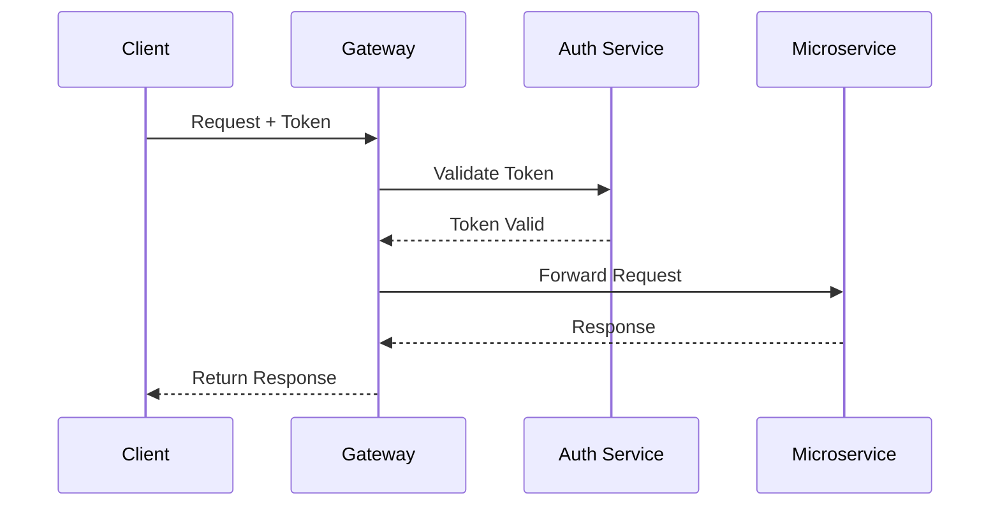

<style>
@import 'default';

section {
  background: linear-gradient(135deg, #667eea 0%, #764ba2 100%);
  color: white;
  font-family: 'Segoe UI', Tahoma, Geneva, Verdana, sans-serif;
}

section h1 {
  color: #fff;
  text-shadow: 2px 2px 4px rgba(0,0,0,0.3);
  border-bottom: 3px solid #ffd700;
  padding-bottom: 10px;
}

section h2 {
  color: #ffd700;
  margin-top: 30px;
}

section code {
  background: rgba(255,255,255,0.1);
  padding: 2px 8px;
  border-radius: 4px;
  color: #ffd700;
}

section pre {
  background: rgba(0,0,0,0.3);
  border-radius: 8px;
  padding: 20px;
  border-left: 4px solid #ffd700;
}

section ul, section ol {
  margin-left: 20px;
}

section li {
  margin: 10px 0;
}

section.title {
  text-align: center;
  display: flex;
  flex-direction: column;
  justify-content: center;
}

section.content-slide {
  background: linear-gradient(135deg, #4a5568 0%, #2d3748 100%);
}

section.security-slide {
  background-image: linear-gradient(rgba(0,0,0,0.7), rgba(0,0,0,0.7)), 
                    url('data:image/svg+xml;base64,PHN2ZyB3aWR0aD0iMTIwMCIgaGVpZ2h0PSI2NzUiIHhtbG5zPSJodHRwOi8vd3d3LnczLm9yZy8yMDAwL3N2ZyI+PGRlZnM+PHBhdHRlcm4gaWQ9ImdyaWQiIHdpZHRoPSI0MCIgaGVpZ2h0PSI0MCIgcGF0dGVyblVuaXRzPSJ1c2VyU3BhY2VPblVzZSI+PHBhdGggZD0iTSAwIDEwIEwgNDAgMTAgTSAxMCAwIEwgMTAgNDAgTSAwIDIwIEwgNDAgMjAgTSAyMCAwIEwgMjAgNDAgTSAwIDMwIEwgNDAgMzAgTSAzMCAwIEwgMzAgNDAiIGZpbGw9Im5vbmUiIHN0cm9rZT0iIzMzMzMzMyIgc3Ryb2tlLXdpZHRoPSIxIi8+PC9wYXR0ZXJuPjwvZGVmcz48cmVjdCB3aWR0aD0iMTIwMCIgaGVpZ2h0PSI2NzUiIGZpbGw9IiMxYTFhMmUiLz48cmVjdCB3aWR0aD0iMTIwMCIgaGVpZ2h0PSI2NzUiIGZpbGw9InVybCgjZ3JpZCkiLz48Y2lyY2xlIGN4PSIzMDAiIGN5PSIyMDAiIHI9IjEwMCIgZmlsbD0iIzY2N2VlYSIgb3BhY2l0eT0iMC4xIi8+PGNpcmNsZSBjeD0iOTAwIiBjeT0iNDAwIiByPSIxNTAiIGZpbGw9IiM3NjRiYTIiIG9wYWNpdHk9IjAuMSIvPjxwYXRoIGQ9Ik01MDAgMTAwIEwgNTUwIDIwMCBMIDQ1MCAyMDAgWiIgZmlsbD0iI2ZmZDcwMCIgb3BhY2l0eT0iMC4xIi8+PHBhdGggZD0iTTcwMCAzMDAgTCA3NTAgNDAwIEwgNjUwIDQwMCBaIiBmaWxsPSIjZmZkNzAwIiBvcGFjaXR5PSIwLjEiLz48L3N2Zz4=');
  background-size: cover;
  background-position: center;
}

section blockquote {
  border-left: 4px solid #ffd700;
  padding-left: 20px;
  margin: 20px 0;
  font-style: italic;
  background: rgba(255,255,255,0.1);
  padding: 15px 20px;
  border-radius: 4px;
}

section table {
  border-collapse: collapse;
  width: 100%;
  margin: 20px 0;
}

section th {
  background: rgba(255,215,0,0.3);
  padding: 12px;
  border: 1px solid rgba(255,255,255,0.2);
}

section td {
  padding: 10px;
  border: 1px solid rgba(255,255,255,0.2);
}
</style>

<!-- _class: title -->
<!-- _paginate: false -->

# API Gateway Documentation

## Enterprise Integration Platform

**Version 2.0 | 2024**

Technical Documentation Team
📧 23f3004149@ds.study.iitm.ac.in

---

## Overview

The API Gateway serves as the central entry point for all microservices in our distributed architecture.

**Key Features:**
- 🔒 Authentication & Authorization
- ⚡ Request Rate Limiting
- 📊 Real-time Analytics
- 🔄 Load Balancing
- 🛡️ Security Filtering

---

## Architecture Components

### Core Services

| Component | Purpose | Technology |
|-----------|---------|------------|
| Gateway Router | Request routing | Node.js |
| Auth Service | Identity management | OAuth 2.0 |
| Cache Layer | Performance optimization | Redis |
| Monitoring | System health tracking | Prometheus |

---

<!-- _class: content-slide -->

## Performance Characteristics

### Time Complexity Analysis

The routing algorithm operates with logarithmic complexity:

$$
T(n) = O(\log n)
$$

For concurrent request handling:

$$
\text{Throughput} = \frac{\text{Requests}}{\text{Time}} \approx \frac{n}{k \cdot \log n}
$$

Where:
- $n$ = number of routes
- $k$ = constant overhead factor

---

## Configuration Example

```yaml
gateway:
  port: 8080
  timeout: 30s
  
  rateLimit:
    enabled: true
    maxRequests: 1000
    windowSize: 60s
  
  routes:
    - path: /api/users/*
      service: user-service
      methods: [GET, POST, PUT]
      
    - path: /api/orders/*
      service: order-service
      methods: [GET, POST]
```

---

<!-- _class: content-slide -->

## Authentication Flow



---

<!-- _class: security-slide -->

# Security Best Practices

- **Always use HTTPS** for production deployments
- Implement **OAuth 2.0** or **JWT** authentication
- Enable **rate limiting** to prevent abuse
- Use **API keys** for service identification
- Regularly **rotate credentials**
- Monitor for **suspicious activity**

---

## Rate Limiting Strategy

### Token Bucket Algorithm

The token bucket algorithm controls request flow:

$$
\text{Tokens}_t = \min(\text{Capacity}, \text{Tokens}_{t-1} + r \cdot \Delta t)
$$

Where:
- $r$ = token refill rate
- $\Delta t$ = time elapsed
- Capacity = maximum bucket size

**Implementation**: Allows burst traffic while maintaining average rate limits.

---

## Deployment Options

### Cloud-Native Architecture

> "Design for failure, implement for resilience"

**Kubernetes Deployment:**
```bash
kubectl apply -f gateway-deployment.yaml
kubectl expose deployment api-gateway --type=LoadBalancer
kubectl autoscale deployment api-gateway --min=3 --max=10
```

**Docker Compose:**
```bash
docker-compose up -d --scale gateway=3
```

---

## Monitoring & Observability

### Key Metrics to Track

1. **Latency Percentiles**: P50, P95, P99
2. **Error Rates**: 4xx and 5xx responses
3. **Throughput**: Requests per second
4. **Resource Utilization**: CPU, Memory, Network

**Alert Thresholds:**
- P99 latency > 500ms
- Error rate > 1%
- CPU usage > 80%

---

## Advanced Features

### Circuit Breaker Pattern

Prevents cascading failures with exponential backoff:

$$
\text{Backoff}_n = \min(\text{MaxDelay}, \text{BaseDelay} \cdot 2^n)
$$

**States:**
- 🟢 **Closed**: Normal operation
- 🟡 **Open**: Failure detected, requests rejected
- 🔵 **Half-Open**: Testing recovery

---

<!-- _class: content-slide -->

## Code Example: Middleware

```javascript
// Rate limiting middleware
const rateLimit = require('express-rate-limit');

const limiter = rateLimit({
  windowMs: 60 * 1000, // 1 minute
  max: 100, // limit each IP to 100 requests per windowMs
  message: 'Too many requests from this IP',
  standardHeaders: true,
  legacyHeaders: false,
});

app.use('/api/', limiter);

// Authentication middleware
app.use('/api/', async (req, res, next) => {
  const token = req.headers.authorization?.split(' ')[1];
  if (!token) return res.status(401).json({ error: 'Unauthorized' });
  
  try {
    const user = await verifyToken(token);
    req.user = user;
    next();
  } catch (err) {
    res.status(403).json({ error: 'Invalid token' });
  }
});
```

---

## Load Balancing Algorithms

### Weighted Round Robin

Distribution formula for $n$ servers:

$$
P(s_i) = \frac{w_i}{\sum_{j=1}^{n} w_j}
$$

Where $w_i$ is the weight of server $i$.

**Benefits:**
- Simple to implement
- Respects server capacity
- Predictable distribution

---

<!-- _class: content-slide -->

## API Versioning Strategy

**Recommended Approach**: URL Path Versioning

```
https://api.example.com/v1/users
https://api.example.com/v2/users
```

**Version Lifecycle:**
- **v1**: Deprecated (6 months notice)
- **v2**: Current stable release
- **v3**: Beta (limited availability)

**Migration Timeline**: Q1 2025

---

## Troubleshooting Guide

### Common Issues

| Issue | Cause | Solution |
|-------|-------|----------|
| High latency | Database queries | Add caching layer |
| 503 errors | Service overload | Scale horizontally |
| Auth failures | Token expiration | Implement refresh tokens |
| Memory leaks | Connection pooling | Configure max connections |

**Debug Mode:**
```bash
DEBUG=gateway:* npm start
```

---

## Best Practices Summary

✅ **DO:**
- Version your APIs from day one
- Implement comprehensive logging
- Use health check endpoints
- Document all endpoints
- Test under load conditions

❌ **DON'T:**
- Expose internal service URLs
- Store secrets in code
- Skip input validation
- Ignore deprecation warnings

---

<!-- _class: title -->

# Thank You

## Questions?

**Documentation Repository:**
github.com/company/api-gateway-docs

**Technical Support:**
📧 23f3004149@ds.study.iitm.ac.in
💬 Slack: #api-gateway-support

**Office Hours:** Mon-Fri, 10 AM - 4 PM IST

---

## Additional Resources

### Learning Materials

- 📚 [API Gateway Design Patterns](https://docs.example.com/patterns)
- 🎥 [Video Tutorial Series](https://learn.example.com/gateway)
- 📖 [Migration Guide v1 → v2](https://docs.example.com/migration)
- 🔧 [Developer Playground](https://playground.example.com)

**Community:**
- Stack Overflow: `api-gateway` tag
- Discord: discord.gg/api-gateway
